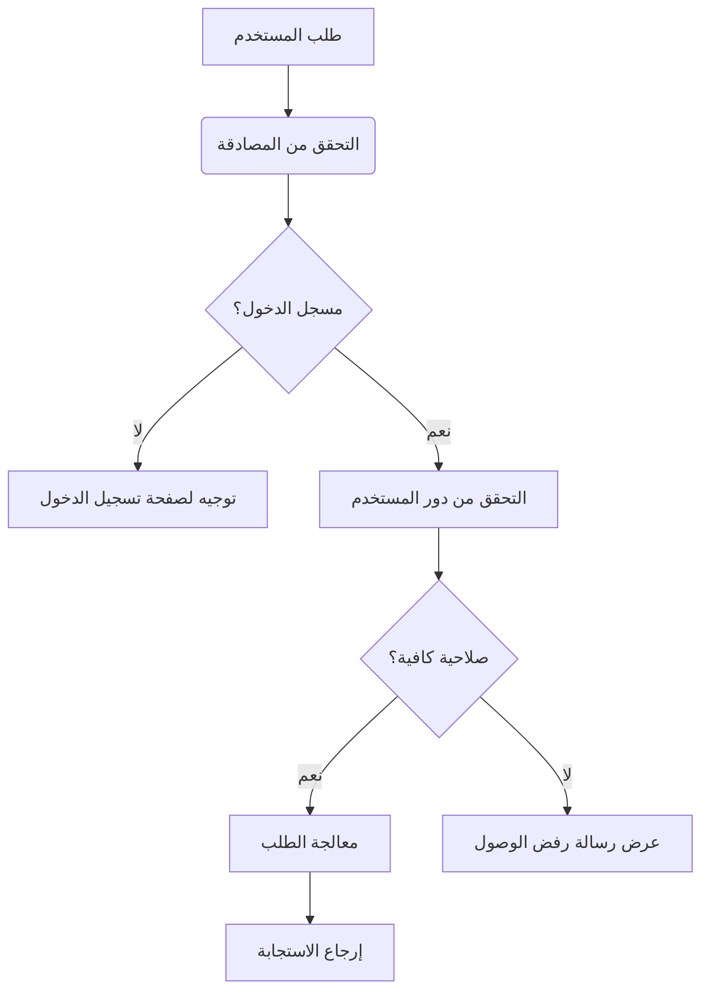

# نظام التحكم في الوصول - StayChill

## هيكل المستويات والصلاحيات

| المستوى | الدور             | الصلاحيات                                                                          |
|---------|-------------------|------------------------------------------------------------------------------------|
| 0       | زائر              | تصفح المحتوى العام، البحث، مشاهدة العقارات والمطاعم                                  |
| 1       | مستخدم مسجل       | جميع صلاحيات المستوى السابق، الحجز، كتابة التقييمات، إدارة الملف الشخصي، تلقي المكافآت |
| 2       | مدير العقارات     | جميع صلاحيات المستوى السابق، إدارة العقارات الخاصة، عرض التحليلات، إدارة الحجوزات      |
| 3       | مدير النظام       | التحكم الكامل، إدارة المستخدمين، إدارة الإعدادات، الوصول إلى البيانات التحليلية         |

## دورة عملية التحقق من الصلاحيات



## نظام الصلاحيات المفصل

### موارد النظام وإجراءات الوصول

| المورد          | القراءة                              | الإنشاء                               | التعديل                                | الحذف                                 |
|-----------------|--------------------------------------|---------------------------------------|----------------------------------------|---------------------------------------|
| العقارات        | زائر (0+)                            | مدير العقارات (2+)                     | مالك العقار (2) أو مدير النظام (3)     | مدير النظام (3)                       |
| الحجوزات        | المستخدم المعني (1+) أو مالك العقار (2+) | مستخدم مسجل (1+)                      | صاحب الحجز (1) أو مالك العقار (2+)     | مدير النظام (3)                       |
| المستخدمين      | المستخدم نفسه (1+) أو مدير النظام (3) | زائر (تسجيل) (0+)                     | المستخدم نفسه (1+) أو مدير النظام (3)  | مدير النظام (3)                       |
| التقييمات       | زائر (0+)                            | مستخدم مسجل قام بالحجز (1+)            | كاتب التقييم (1) أو مدير النظام (3)    | كاتب التقييم (1) أو مدير النظام (3)   |
| المطاعم         | زائر (0+)                            | مدير النظام (3)                       | مدير النظام (3)                        | مدير النظام (3)                       |
| حجوزات المطاعم  | المستخدم المعني (1+) أو مدير النظام (3) | مستخدم مسجل (1+)                      | صاحب الحجز (1) أو مدير النظام (3)      | صاحب الحجز (1) أو مدير النظام (3)     |
| المكافآت        | المستخدم المعني (1+) أو مدير النظام (3) | مدير النظام (3)                       | مدير النظام (3)                        | مدير النظام (3)                       |
| الإعدادات       | مدير النظام (3)                       | مدير النظام (3)                       | مدير النظام (3)                        | مدير النظام (3)                       |
| التحليلات       | مدير العقارات (محدودة) (2) أو مدير النظام (3) | -                                     | -                                      | -                                     |

## تنفيذ نظام التحكم في الوصول

### المكونات الأساسية

1. **AccessGuard**: مكون لحماية الصفحات والمكونات حسب مستوى الوصول
```tsx
<AccessGuard 
  requiredTier={ACCESS_TIERS.PROPERTY_ADMIN} 
  fallback={<UnauthorizedPage />}
>
  <PropertyManagementDashboard />
</AccessGuard>
```

2. **TieredContent**: مكون لعرض محتوى مختلف بناءً على مستوى المستخدم
```tsx
<TieredContent
  tierContent={{
    [ACCESS_TIERS.VISITOR]: <PublicPropertyView />,
    [ACCESS_TIERS.USER]: <UserPropertyView />,
    [ACCESS_TIERS.PROPERTY_ADMIN]: <AdminPropertyView />,
    [ACCESS_TIERS.SUPER_ADMIN]: <SuperAdminPropertyView />,
  }}
  defaultContent={<LimitedAccessView />}
/>
```

3. **وظائف التحقق من الوصول**:
```typescript
// التحقق مما إذا كان المستخدم يمتلك مستوى وصول معين
const canManageProperty = hasAccessTier(
  user, 
  ACCESS_TIERS.PROPERTY_ADMIN
);

// التحقق من صلاحية على مورد محدد
const canEditBooking = hasPermission(
  user.role,
  PermissionAction.UPDATE,
  ResourceType.BOOKING,
  { bookingUserId: userId, bookingId: id }
);
```

## تعليمات الاستخدام للمطورين

### إضافة حماية للصفحات

1. استخدم مكون `AccessGuard` لحماية الصفحات:
```tsx
import { AccessGuard } from '@/components/auth/access-guard';
import { ACCESS_TIERS } from '@/lib/access-control';

function ProtectedPage() {
  return (
    <AccessGuard 
      requiredTier={ACCESS_TIERS.USER} 
      redirectTo="/auth/login"
    >
      <YourProtectedContent />
    </AccessGuard>
  );
}
```

### استخدام محتوى متغير حسب مستوى المستخدم

```tsx
import { TieredContent } from '@/components/auth/tiered-content';
import { ACCESS_TIERS } from '@/lib/access-control';

function DynamicContent() {
  return (
    <TieredContent
      tierContent={{
        [ACCESS_TIERS.VISITOR]: <p>محتوى للزوار</p>,
        [ACCESS_TIERS.USER]: <p>محتوى للمستخدمين المسجلين</p>,
        [ACCESS_TIERS.PROPERTY_ADMIN]: <p>محتوى لمديري العقارات</p>,
        [ACCESS_TIERS.SUPER_ADMIN]: <p>محتوى للمدير العام</p>,
      }}
    />
  );
}
```

### التحقق من الصلاحيات في مكونات API

```typescript
// مثال على التحقق من الصلاحيات في وظيفة API
app.patch('/api/properties/:id', async (req, res) => {
  const { id } = req.params;
  const user = req.user;
  
  // التحقق من مستوى الوصول
  if (!hasAccessTier(user, ACCESS_TIERS.PROPERTY_ADMIN)) {
    return res.status(403).json({ error: 'غير مصرح لك بتعديل العقارات' });
  }
  
  // التحقق من ملكية العقار (للمدراء فقط)
  if (
    user.role === UserRole.PROPERTY_ADMIN && 
    !await isPropertyOwner(user.id, id)
  ) {
    return res.status(403).json({ error: 'غير مصرح لك بتعديل هذا العقار' });
  }
  
  // متابعة المعالجة عند امتلاك الصلاحيات
  // ...
});
```

## قواعد عامة للتحكم في الوصول

1. دائمًا قم بالتحقق من الصلاحيات على مستوى الواجهة الخلفية حتى مع وجود تحقق في الواجهة الأمامية
2. استخدم التحقق المتعدد المستويات: المصادقة ثم مستوى الوصول ثم ملكية الموارد
3. تأكد من تطبيق قواعد الوصول على جميع نقاط نهاية API بشكل متسق
4. لا تعتمد على الدور فقط، تحقق من العلاقات والملكية عند التعامل مع الموارد المحددة