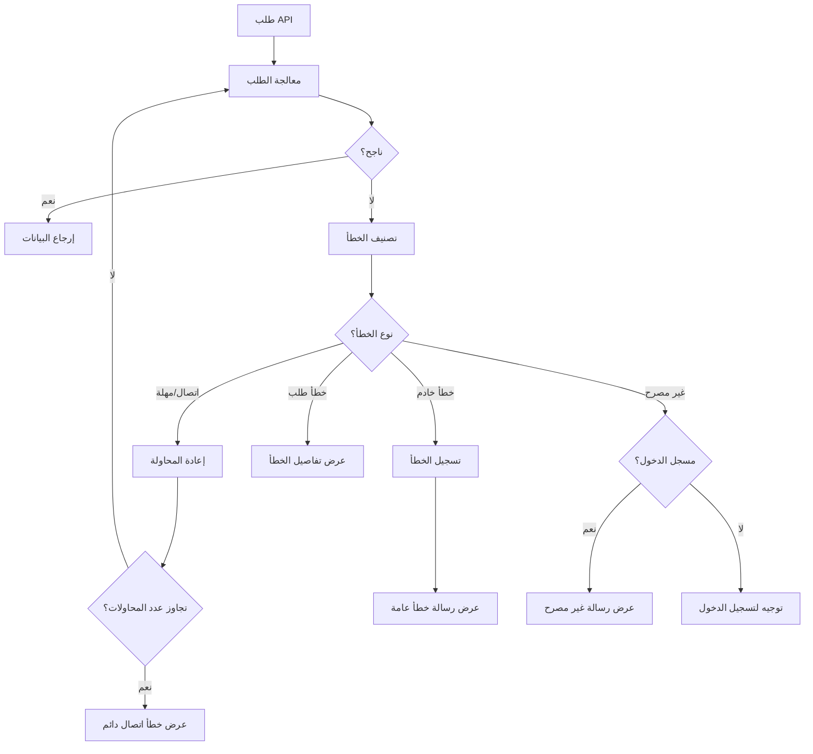

# نظام معالجة الأخطاء - StayChill

## أنواع الأخطاء المدعومة

| نوع الخطأ          | الوصف                                    | رمز الحالة | آلية المعالجة                             |
|--------------------|------------------------------------------|------------|-------------------------------------------|
| `connection`       | أخطاء الاتصال بالشبكة                    | غير متاح   | إعادة المحاولة تلقائيًا مع التراجع الخطي  |
| `timeout`          | انتهاء مهلة الطلب                        | 408        | إعادة المحاولة مع مهلة أطول              |
| `server`           | أخطاء داخلية في الخادم                   | 500+       | تسجيل الخطأ وعرض رسالة للمستخدم          |
| `request`          | طلب غير صالح أو بيانات غير مكتملة         | 400-499    | عرض رسالة توضيحية للمستخدم               |
| `unauthorized`     | مشاكل في المصادقة أو الصلاحيات            | 401, 403   | توجيه المستخدم إلى صفحة تسجيل الدخول     |

## بنية نظام معالجة الأخطاء



## مكونات نظام معالجة الأخطاء

### 1. NetworkErrorContext

سياق يوفر حالة الأخطاء ووظائف المعالجة لجميع أجزاء التطبيق.

```tsx
// سياق الأخطاء المركزي
export const NetworkErrorContext = createContext<NetworkErrorContextType>({
  error: null,
  setError: () => {},
  clearError: () => {},
  isLoading: false,
  setIsLoading: () => {},
});

// مزود سياق الأخطاء
export const NetworkErrorProvider: React.FC<{ children: React.ReactNode }> = ({ children }) => {
  const [error, setError] = useState<NetworkError | null>(null);
  const [isLoading, setIsLoading] = useState<boolean>(false);
  
  const clearError = useCallback(() => setError(null), []);
  
  return (
    <NetworkErrorContext.Provider 
      value={{ 
        error, 
        setError, 
        clearError, 
        isLoading, 
        setIsLoading 
      }}
    >
      {children}
    </NetworkErrorContext.Provider>
  );
};
```

### 2. NetworkErrorFeedback

مكون لعرض رسائل الخطأ بطريقة متسقة وجذابة.

```tsx
interface NetworkErrorFeedbackProps {
  error: NetworkError;
  onRetry?: () => void;
  className?: string;
}

// مكون عرض الأخطاء
export const NetworkErrorFeedback: React.FC<NetworkErrorFeedbackProps> = ({
  error,
  onRetry,
  className
}) => {
  // رسائل مخصصة حسب نوع الخطأ
  const errorMessages: Record<NetworkErrorType, string> = {
    connection: 'حدثت مشكلة في الاتصال بالخادم. الرجاء التحقق من اتصالك بالإنترنت.',
    timeout: 'استغرق الطلب وقتًا طويلاً. الرجاء المحاولة مرة أخرى.',
    server: 'حدث خطأ في الخادم. نحن نعمل على إصلاحه.',
    request: `حدث خطأ في طلبك: ${error.message}`,
    unauthorized: 'غير مصرح لك بالوصول إلى هذه البيانات.',
  };

  return (
    <div className={cn("rounded-md border p-4", className)}>
      <div className="flex items-start gap-4">
        <div className="flex-shrink-0 text-destructive">
          <AlertCircle className="h-5 w-5" />
        </div>
        <div className="flex-1">
          <h3 className="font-medium">خطأ في الطلب</h3>
          <p className="mt-1 text-sm text-muted-foreground">
            {errorMessages[error.type] || error.message}
          </p>
          {onRetry && (
            <Button 
              variant="outline" 
              size="sm" 
              className="mt-3" 
              onClick={onRetry}
            >
              <RefreshCw className="h-4 w-4 mr-2" />
              إعادة المحاولة
            </Button>
          )}
        </div>
      </div>
    </div>
  );
};
```

### 3. NetworkErrorContainer

حاوية لعرض رسائل الخطأ في مناطق محددة من التطبيق.

```tsx
interface NetworkErrorContainerProps {
  children: React.ReactNode;
  fallback?: React.ReactNode;
  resetCondition?: any[];
}

// حاوية الأخطاء مع دعم إعادة المحاولة
export const NetworkErrorContainer: React.FC<NetworkErrorContainerProps> = ({
  children,
  fallback,
  resetCondition = [],
}) => {
  const { error, clearError } = useContext(NetworkErrorContext);
  const queryClient = useQueryClient();
  
  // إعادة ضبط الخطأ عند تغير شروط إعادة الضبط
  useEffect(() => {
    clearError();
  }, resetCondition);
  
  // تنفيذ إعادة المحاولة
  const handleRetry = useCallback(() => {
    clearError();
    queryClient.invalidateQueries();
  }, [clearError, queryClient]);
  
  if (error) {
    if (fallback) {
      return <>{fallback}</>;
    }
    
    return (
      <NetworkErrorFeedback
        error={error}
        onRetry={handleRetry}
      />
    );
  }
  
  return <>{children}</>;
};
```

## تكامل نظام الأخطاء مع طلبات API

### 1. تكوين عميل الاستعلام

```typescript
// إعداد عميل الاستعلام لمعالجة الأخطاء
export const queryClient = new QueryClient({
  defaultOptions: {
    queries: {
      retry: (failureCount, error: any) => {
        // إعادة المحاولة للأخطاء الخاصة بالاتصال فقط
        if (error?.type === 'connection' || error?.type === 'timeout') {
          return failureCount < 3;
        }
        return false;
      },
      retryDelay: attemptIndex => Math.min(1000 * 2 ** attemptIndex, 30000),
      onError: (error: any) => {
        console.error('Query error:', error);
      },
    },
    mutations: {
      onError: (error: any) => {
        console.error('Mutation error:', error);
      },
    },
  },
});
```

### 2. وظيفة طلب API

```typescript
// وظيفة API تتعامل مع الأخطاء بشكل موحد
export const apiRequest = async (
  method: string,
  endpoint: string,
  data?: any,
  options?: RequestInit
): Promise<Response> => {
  try {
    const response = await fetch(endpoint, {
      method,
      headers: {
        'Content-Type': 'application/json',
      },
      body: data ? JSON.stringify(data) : undefined,
      ...options,
    });

    if (!response.ok) {
      let errorType: NetworkErrorType = 'request';
      const status = response.status;
      
      if (status >= 500) {
        errorType = 'server';
      } else if (status === 401 || status === 403) {
        errorType = 'unauthorized';
      }
      
      const responseData = await response.json().catch(() => ({}));
      const errorMessage = responseData.message || response.statusText;
      
      throw { 
        type: errorType, 
        status, 
        message: errorMessage, 
        data: responseData 
      };
    }
    
    return response;
  } catch (error: any) {
    // تحويل أخطاء الشبكة الأصلية إلى تنسيق موحد
    if (error.name === 'AbortError') {
      throw { type: 'timeout', message: 'تم إلغاء الطلب بسبب انتهاء المهلة' };
    }
    
    if (error instanceof TypeError && error.message.includes('Network')) {
      throw { type: 'connection', message: 'فشل الاتصال بالخادم' };
    }
    
    // إعادة إرسال الأخطاء المصنفة مسبقًا
    if (error.type) {
      throw error;
    }
    
    // تصنيف أي أخطاء أخرى كأخطاء خادم
    throw { type: 'server', message: error.message || 'حدث خطأ غير متوقع' };
  }
};
```

## تعليمات الاستخدام للمطورين

### 1. استخدام NetworkErrorContainer

```tsx
// غلاف لمكون يحتاج إلى معالجة أخطاء
function PropertyList() {
  const propertiesQuery = useQuery({
    queryKey: ['/api/properties'],
  });
  
  return (
    <NetworkErrorContainer>
      {propertiesQuery.isLoading ? (
        <PropertyListSkeleton />
      ) : (
        <div className="grid grid-cols-1 md:grid-cols-2 lg:grid-cols-3 gap-4">
          {propertiesQuery.data?.map(property => (
            <PropertyCard key={property.id} property={property} />
          ))}
        </div>
      )}
    </NetworkErrorContainer>
  );
}
```

### 2. استخدام أخطاء التطبيق

```tsx
// مثال على استخدام معالجة الأخطاء في المكونات
function BookingForm() {
  const { error, setError, clearError } = useContext(NetworkErrorContext);
  
  const bookingMutation = useMutation({
    mutationFn: async (data) => {
      const res = await apiRequest('POST', '/api/bookings', data);
      return await res.json();
    },
    onError: (error: any) => {
      setError({
        type: error.type || 'request',
        message: error.message || 'فشل إنشاء الحجز',
        status: error.status
      });
    },
    onSuccess: () => {
      clearError();
      toast({
        title: 'تم إنشاء الحجز بنجاح',
        description: 'يمكنك مراجعة تفاصيل الحجز في صفحة الحجوزات',
      });
    }
  });
  
  // استخدام نموذج مع التعامل مع الأخطاء
  const onSubmit = (formData) => {
    clearError();
    bookingMutation.mutate(formData);
  };
  
  return (
    <Form onSubmit={onSubmit}>
      {/* محتوى النموذج */}
      {error && <NetworkErrorFeedback error={error} />}
    </Form>
  );
}
```

### 3. تطبيق الأخطاء المخصصة

```typescript
// مثال على رمي أخطاء مخصصة من وظائف API
app.post('/api/bookings', async (req, res) => {
  try {
    const { propertyId, startDate, endDate } = req.body;
    
    if (!propertyId || !startDate || !endDate) {
      return res.status(400).json({
        message: 'معلومات الحجز غير مكتملة',
        details: 'يرجى تحديد العقار وتواريخ الإقامة'
      });
    }
    
    const property = await storage.getProperty(propertyId);
    
    if (!property) {
      return res.status(404).json({
        message: 'العقار غير موجود',
        details: 'لا يمكن العثور على العقار المطلوب'
      });
    }
    
    // التحقق من توفر العقار
    const isAvailable = await storage.checkPropertyAvailability(
      propertyId, 
      new Date(startDate), 
      new Date(endDate)
    );
    
    if (!isAvailable) {
      return res.status(400).json({
        message: 'العقار غير متاح في التواريخ المحددة',
        details: 'الرجاء اختيار تواريخ أخرى أو عقار آخر'
      });
    }
    
    // إنشاء الحجز
    const booking = await storage.createBooking(/* ... */);
    
    res.status(201).json(booking);
  } catch (error) {
    console.error('Error creating booking:', error);
    res.status(500).json({
      message: 'حدث خطأ أثناء معالجة الحجز',
      details: 'الرجاء المحاولة مرة أخرى لاحقًا'
    });
  }
});
```

## أفضل الممارسات لمعالجة الأخطاء

1. استخدم تصنيفات الأخطاء المحددة لتقديم تجربة مستخدم أفضل
2. قم دائمًا بتسجيل تفاصيل الأخطاء كاملة على الخادم، مع عرض رسائل مبسطة للمستخدم
3. توفير إمكانية إعادة المحاولة عند مواجهة أخطاء الاتصال أو المهلة
4. الاحتفاظ بحالة الواجهة في حالة فشل الطلب لتجنب فقدان بيانات المستخدم
5. استخدام آليات التراجع الخطي لإعادة المحاولات التلقائية
6. توحيد معالجة الأخطاء عبر التطبيق بأكمله باستخدام السياق المركزي