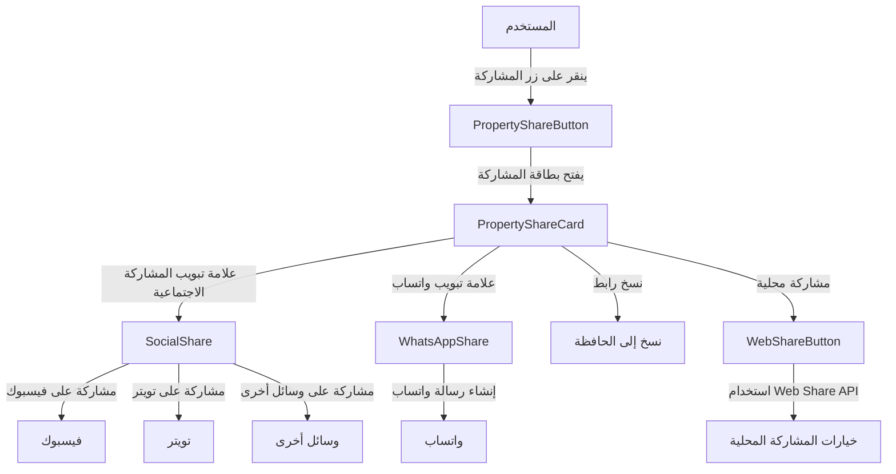

# نظام المشاركة الاجتماعية - StayChill

## مكونات نظام المشاركة

يتكون نظام المشاركة من عدة مكونات أساسية تعمل معًا لتوفير تجربة مشاركة متكاملة ومرنة.

### 1. SocialShare

المكون الأساسي للمشاركة على منصات التواصل الاجتماعي المختلفة.

```tsx
// مكون المشاركة الاجتماعية الأساسي
interface SocialShareProps {
  url: string;
  title?: string;
  description?: string;
  image?: string;
  platforms?: ('facebook' | 'twitter' | 'linkedin' | 'telegram' | 'whatsapp' | 'email')[];
  className?: string;
  compact?: boolean;
}

// مثال على الاستخدام
<SocialShare
  url="https://staychill.com/property/123"
  title="شاليه رائع في رأس الحكمة"
  description="أجمل شاليه في رأس الحكمة مع إطلالة مباشرة على البحر"
  image="https://staychill.com/images/property-123.jpg"
  platforms={['facebook', 'twitter', 'whatsapp']}
/>
```

### 2. WebShareButton

مكون يستخدم Web Share API للمشاركة من خلال خيارات المشاركة المحلية للجهاز.

```tsx
// مكون مشاركة الويب (يستخدم Web Share API)
interface WebShareButtonProps {
  data: {
    url: string;
    title?: string;
    text?: string;
    files?: File[];
  };
  onSuccess?: () => void;
  onError?: (error: Error) => void;
  disabled?: boolean;
  children?: ReactNode;
  className?: string;
}

// مثال على الاستخدام
<WebShareButton
  data={{
    url: propertyUrl,
    title: property.title,
    text: `تحقق من هذا العقار الرائع: ${property.title} في ${property.location}`
  }}
  onSuccess={() => toast({ title: "تمت المشاركة بنجاح" })}
>
  <Button variant="outline" size="sm">
    <Share2 className="h-4 w-4 mr-2" />
    مشاركة
  </Button>
</WebShareButton>
```

### 3. WhatsAppShare

مكون متخصص للمشاركة عبر تطبيق واتساب، مهم بشكل خاص للمستخدمين العرب.

```tsx
// مكون مشاركة واتساب
interface WhatsAppShareProps {
  url: string;
  message?: string;
  className?: string;
  variant?: 'default' | 'destructive' | 'outline' | 'secondary' | 'ghost' | 'link';
  size?: 'default' | 'sm' | 'lg' | 'icon';
  children?: React.ReactNode;
  showLabel?: boolean;
  label?: string;
  phoneNumber?: string;
  onSuccess?: () => void;
}

// مثال على الاستخدام
<WhatsAppShare
  url={propertyUrl}
  message={`تحقق من هذا العقار الرائع في ${property.location}:`}
  showLabel={true}
  label="مشاركة عبر واتساب"
/>
```

### 4. DynamicShare

مكون مشاركة ديناميكي يتيح نسخ الرابط والمشاركة عبر وسائل متعددة.

```tsx
// مكون المشاركة الديناميكي
interface DynamicShareProps {
  url: string;
  title?: string;
  description?: string;
  image?: string;
  className?: string;
}

// مثال على الاستخدام
<DynamicShare
  url={propertyUrl}
  title={property.title}
  description={property.description}
  image={property.image}
/>
```

### 5. PropertyShareButton

زر مخصص لمشاركة العقارات مع بطاقة مشاركة مخصصة.

```tsx
// زر مشاركة العقار
interface PropertyShareButtonProps {
  property: {
    id: number;
    title: string;
    location: string;
    image: string;
    price: number;
    rating?: number;
    description?: string;
  };
  variant?: 'default' | 'destructive' | 'outline' | 'secondary' | 'ghost' | 'link';
  size?: 'default' | 'sm' | 'lg' | 'icon';
  showLabel?: boolean;
  label?: string;
  className?: string;
}

// مثال على الاستخدام
<PropertyShareButton
  property={property}
  showLabel={true}
  label="مشاركة العقار"
/>
```

### 6. PropertyShareCard

بطاقة مشاركة مخصصة للعقارات توفر واجهة متقدمة للمشاركة.

```tsx
// بطاقة مشاركة العقار
interface PropertyShareCardProps {
  property: {
    id: number;
    title: string;
    location: string;
    image: string;
    price: number;
    rating?: number;
    description?: string;
  };
  className?: string;
  isOpen: boolean;
  onClose: () => void;
}

// مكون PropertyShareCard يتم استدعاؤه من PropertyShareButton
// ويوفر واجهة متقدمة للمشاركة مع علامات تبويب وخيارات متعددة
```

## تدفق المشاركة



## استراتيجيات المشاركة

### 1. المشاركة المباشرة

مشاركة مباشرة للمحتوى على منصات التواصل الاجتماعي مع بيانات وصفية.

```tsx
// مثال على استخدام SocialShare في صفحة تفاصيل العقار
<Card className="border-border shadow-sm">
  <CardHeader>
    <CardTitle>مشاركة هذا العقار</CardTitle>
  </CardHeader>
  <CardContent>
    <SocialShare
      url={`${window.location.origin}/property/${property.id}`}
      title={`${property.title} - StayChill`}
      description={`اكتشف هذا العقار الرائع في ${property.location}. ${property.description?.substring(0, 100)}...`}
      image={property.image}
      platforms={['facebook', 'twitter', 'linkedin', 'telegram', 'whatsapp', 'email']}
    />
  </CardContent>
</Card>
```

### 2. المشاركة المنبثقة

استخدام بطاقة منبثقة للمشاركة مع خيارات متقدمة.

```tsx
// مثال على استخدام PropertyShareButton في قائمة العقارات
<div className="grid grid-cols-1 md:grid-cols-2 lg:grid-cols-3 gap-6">
  {properties.map(property => (
    <PropertyCard key={property.id} property={property}>
      <div className="flex justify-between mt-3">
        <Button variant="outline" size="sm">
          <Heart className="h-4 w-4 mr-2" />
          إضافة للمفضلة
        </Button>
        
        <PropertyShareButton
          property={property}
          variant="outline"
          size="sm"
          showLabel={false}
        />
      </div>
    </PropertyCard>
  ))}
</div>
```

### 3. المشاركة عبر واتساب

خيار مخصص للمشاركة عبر واتساب مع إمكانية تخصيص الرسالة.

```tsx
// مثال على استخدام WhatsAppShare في صفحة تأكيد الحجز
<Card className="bg-success/10 border-success">
  <CardHeader>
    <CardTitle>تم تأكيد الحجز!</CardTitle>
  </CardHeader>
  <CardContent>
    <p>تم تأكيد حجزك بنجاح. شارك هذا العقار مع أصدقائك!</p>
  </CardContent>
  <CardFooter>
    <WhatsAppShare
      url={`${window.location.origin}/property/${property.id}`}
      message={`لقد حجزت إقامة رائعة في ${property.title} من خلال StayChill! تحقق من هذا العقار:`}
      variant="default"
      label="مشاركة تفاصيل العقار"
      className="w-full"
    />
  </CardFooter>
</Card>
```

## أفضل الممارسات للمشاركة

1. **تخصيص البيانات الوصفية**:
   - تأكد من تقديم عناوين وأوصاف وصور مخصصة لكل محتوى
   - استخدم بيانات وصفية متوافقة مع Open Graph وTwitter Cards

2. **تبسيط المشاركة**:
   - ضع أزرار المشاركة في أماكن بارزة وسهلة الوصول
   - تجنب إضافة الكثير من منصات المشاركة في نفس المكان

3. **مراعاة الخصوصية**:
   - لا تشارك البيانات الشخصية أو معلومات الحجز الحساسة
   - أضف تنبيهات الخصوصية عند الضرورة

4. **قياس فعالية المشاركة**:
   - تتبع عدد المشاركات وأنواعها ومصادرها
   - استخدم وسوم UTM في الروابط لتتبع مصادر الزيارات

5. **تحسين قابلية المشاركة**:
   - تأكد من أن المحتوى المشارك جذاب وملخص بشكل جيد
   - استخدم صور عالية الجودة للعقارات في معاينات المشاركة

## تكامل نظام المشاركة مع الميزات الأخرى

1. **نظام المكافآت**:
   - منح نقاط ChillPoints للمستخدمين الذين يشاركون العقارات
   - تقديم مكافآت إضافية عند قيام الأصدقاء بالحجز من خلال الروابط المشتركة

2. **التحليلات**:
   - تتبع المشاركات والتحويلات الناتجة عنها
   - تحليل المنصات الأكثر فعالية للمشاركة

3. **التسويق**:
   - تشجيع المستخدمين على مشاركة تجاربهم الإيجابية
   - إنشاء حملات تسويقية معتمدة على المشاركة الاجتماعية

4. **تحسين SEO**:
   - ضمان توافق بيانات المشاركة مع متطلبات محركات البحث
   - استخدام بيانات وصفية غنية لتحسين ظهور المحتوى المشارك